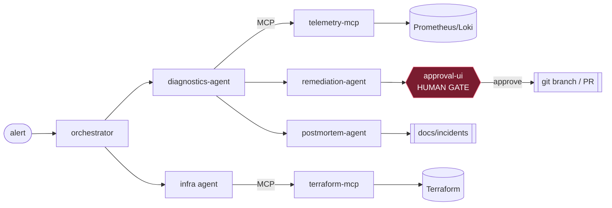

# Agentic Cloud Incident-Response Copilot

A multi-agent AI system that monitors a demo microservice environment, diagnoses
infrastructure/application faults, proposes remediations as **reviewable pull requests**
(never direct execution), and drafts postmortems.

**Core principle:** agents are read-only by default; every mutating action passes through a
human-approval gate.

**Local-first:** the whole stack runs on a laptop via Docker Compose. A cloud-provider
abstraction layer (`copilot-core`) means the same code later points at real AWS
(CloudWatch, ECS) with only configuration changes.

---

## Status

| Phase | Description | State |
|------|-------------|-------|
| 0 | Skeleton + local observability stack + demo app with fault injection | ✅ implemented |
| 1 | Telemetry abstraction (`TelemetryProvider`) + Prometheus/Loki impl + `telemetry-mcp` MCP server | ✅ implemented |
| 2 | Diagnostics agent (LangChain4j + Claude): agentic loop, 15-tool-call cap, evidence-cited `Diagnosis`, model routing, tracing | ✅ implemented¹ |
| 3 | Orchestrator (classify → delegate → merge) + infra/drift agent + `terraform-mcp` (drift detection) | ✅ implemented¹ |
| 4 | Remediation agent (diff proposals) + approval UI + human-gated branch/PR creation | ✅ implemented¹ |
| 5 | Postmortem agent — timeline from traces, root cause, prevention → Markdown in `docs/incidents/` | ✅ implemented¹ |
| 6 | Eval harness — 20 YAML fault scenarios, runner scores root-cause/cost/tool-calls → Markdown scorecard | ✅ implemented¹ |
| 7 | Trace viewer in approval UI + architecture/guardrails/failure-analysis docs | ✅ implemented¹ |
| 8 | AWS deployment mapping ([`infra/aws/README.md`](infra/aws/README.md)) — docs-only stub, as planned | ✅ documented |

---

## Architecture at a glance



Read-only agents observe via MCP tools; the remediation agent only *proposes* a diff; a human
approves before anything becomes a branch/PR. Full details:

- **[docs/architecture.md](docs/architecture.md)** — components, sequence diagrams, model routing
- **[docs/guardrails.md](docs/guardrails.md)** — the read-only + human-gate guarantees (enforced in code)
- **[docs/failure-analysis.md](docs/failure-analysis.md)** — honest failure modes and limitations

---

## Prerequisites

- **Docker + Docker Compose** — the only hard requirement to run the stack.
  - **Windows:** the recommended, license-free setup is **Docker Engine inside WSL2** (Docker
    Desktop needs a paid license at large companies). Quick path:
    ```powershell
    wsl --install                 # in an ADMIN PowerShell, then reboot
    wsl --install -d Ubuntu-24.04 # create a UNIX user when prompted
    ```
    Then inside Ubuntu:
    ```bash
    curl -fsSL https://get.docker.com | sh
    sudo usermod -aG docker $USER
    printf '[boot]\nsystemd=true\n' | sudo tee /etc/wsl.conf
    ```
    Back in PowerShell run `wsl --shutdown`, reopen Ubuntu, then `sudo systemctl enable --now docker`
    and verify with `docker run hello-world`. Run all project commands **from inside the Ubuntu shell**.
  - **macOS/Linux:** any recent Docker Engine / Docker Desktop.
- **An Anthropic API key** — only needed for the agent phases (2+) to make **live** Claude calls.
  Not required to build, run the stack, or run the tests. See [Configuring your API key](#configuring-your-api-key).
- JDK 21 + Maven 3.9+ — only if you want to build/test the Java modules **outside** Docker
  (`mvn test`). The Docker build does this for you.

## Configuring your API key

```bash
cp .env.example .env      # .env is git-ignored — safe to store the key here
# edit .env and set:  ANTHROPIC_API_KEY=sk-ant-...
```
> The **API** (what the agents call) is pay-as-you-go and needs prepaid credits at
> `console.anthropic.com` → Billing. The free "Evaluation" plan (claude.ai chat) does **not** include
> API credits. Without credits, a live `/diagnose` returns a "credit balance too low" error — the
> rest of the stack still runs, and all tests pass, without any key.

## Start the stack

From the the powershell window run this command to start the Ubantu:

```bash
wsl -d Ubuntu-24.04
```

From the project root (inside your Ubuntu/WSL shell on Windows):

```bash
docker compose up -d --build
```
The first run takes ~5–15 min (it builds the three Java images and pulls Prometheus/Loki/Grafana);
later starts are seconds. Check everything is healthy:

```bash
docker compose ps                       # wait for demo-app / telemetry-mcp / diagnostics-agent = healthy
docker compose logs -f diagnostics-agent   # optional: follow a service's logs (Ctrl-C to stop)
```

Ports (reachable from your Windows browser too, via WSL2 localhost forwarding):

| Service | URL |
|---------|-----|
| Demo app | http://localhost:8080 |
| Diagnostics agent | http://localhost:8100 |
| telemetry-mcp | http://localhost:8090 |
| Prometheus | http://localhost:9090 |
| Grafana | http://localhost:3000 → dashboard "Demo App — SRE Copilot" |
| Loki (via Grafana Explore) | http://localhost:3000/explore |

## Run a test

```bash
# 1. inject a 3s latency fault and drive traffic so it shows up in Prometheus
curl -X POST "http://localhost:8080/faults/latency?ms=3000"
for i in $(seq 1 15); do curl -s -X POST http://localhost:8080/checkout > /dev/null; done

# 2. ask the agent to diagnose (needs Anthropic credits — see above)
curl -s -X POST http://localhost:8100/diagnose \
  -H "Content-Type: application/json" \
  -d '{"alert":"P95 latency on checkout > 2s"}'

# 3. inspect the full trace (every LLM + tool call, tokens, cost) using the returned traceId
curl -s http://localhost:8100/traces/<traceId>

# 4. clear the fault when done
curl -X POST http://localhost:8080/faults/reset
```

## Stop the stack

```bash
docker compose stop      # pause everything, keep containers/images (fastest restart: docker compose start)
# — or —
docker compose down      # stop AND remove containers + network (keeps built images)
docker compose down -v   # also remove volumes (Prometheus/Loki/Grafana data) — full clean slate
```

Rebuild after code changes: `docker compose up -d --build`. Rebuild one service:
`docker compose up -d --build diagnostics-agent`.

## Demo app endpoints

| Method | Path | Purpose |
|--------|------|---------|
| GET | `/inventory` | Business endpoint (subject to injected faults) |
| POST | `/checkout` | Business endpoint (subject to injected faults) |
| POST | `/faults/latency?ms=` | Inject artificial latency |
| POST | `/faults/error-rate?pct=` | Inject a 5xx error rate |
| POST | `/faults/memory-leak?mb=` | Retain heap to simulate a leak |
| POST | `/faults/crash` | Hard-crash the process |
| POST | `/faults/reset` | Clear all injected faults |
| GET | `/actuator/prometheus` | Metrics scraped by Prometheus |

## telemetry-mcp (Phase 1)

A read-only MCP server (port `8090`, HTTP/SSE transport at `/sse` + `/mcp/message`) that exposes the
provider-agnostic `TelemetryProvider` as three tools the agents call:

| Tool | Arguments | Backend |
|------|-----------|---------|
| `query_metrics` | `query` (PromQL), `rangeMinutes` | Prometheus `query_range` |
| `query_logs` | `filter` (LogQL), `rangeMinutes`, `limit` | Loki `query_range` |
| `list_alerts` | — | Prometheus `/api/v1/alerts` |

The same `TelemetryProvider` interface is what a future `CloudWatchTelemetryProvider` implements —
the seam that turns "local now" into "AWS later" as a config change (see Phase 8).

> ¹ Phase 2 is fully built and unit/integration-tested with a mocked model (no key needed). Its live
> acceptance test — inject a latency fault, feed the agent the alert, watch it cite the latency
> source — needs `ANTHROPIC_API_KEY` + the running stack.

## diagnostics-agent (Phase 2)

A single-agent loop (`POST /diagnose`, port `8100`) built on **LangChain4j + Claude**:

```bash
curl -s -X POST http://localhost:8100/diagnose \
  -H 'Content-Type: application/json' \
  -d '{"alert":"P95 latency on checkout > 2s"}'
```

Returns a structured `Diagnosis {hypothesis, evidence[], confidence, suggestedNextSteps, truncated}`
plus a `traceId`; fetch the full trace (every LLM + tool call, tokens, latency, cost) at
`GET /traces/{traceId}`. Guardrails enforced **in code**: read-only tools only, a hard 15-tool-call
budget, and a `ModelRouter` that keeps cheap steps (log summarization) on Haiku while planning uses
Sonnet. Requires `ANTHROPIC_API_KEY`; reads telemetry via `telemetry-mcp` over MCP.

## orchestrator + infra agent (Phase 3)

The **orchestrator** (`POST /incident`, port `8110`) classifies an incident with one Claude call,
then delegates: to the diagnostics agent (over HTTP) for application faults and/or the **infra/drift
agent** for infrastructure drift, and merges the findings into an `OrchestratedFindings`.

```bash
curl -s -X POST http://localhost:8110/incident \
  -H 'Content-Type: application/json' \
  -d '{"alert":"checkout is slow and someone may have changed the container config"}'
```

The infra agent calls **`terraform-mcp`** (port `8091`, tools `read_state` + `plan_diff`), which runs
a read-only, refresh-only `terraform plan` against [`infra/local`](infra/local/) and returns a
structured `DriftReport`. Delegation is resilient — if one sub-agent fails (e.g. the diagnostics
agent has no API credit), the other's findings are still returned. To see drift detection end-to-end,
follow [`infra/local/README.md`](infra/local/README.md) (build image → `terraform apply` → change the
container out-of-band → the agent reports the drift). The agent **never applies** — reconciliation
becomes a proposed diff in Phase 4.

## remediation agent + approval gate (Phase 4)

The **remediation agent** (`POST /propose`, port `8120`) consumes a diagnosis/drift plus the current
content of a config file and proposes a **minimal fix as a reviewable diff** — it computes a real
unified diff and rollback notes, and **never applies anything**. It can auto-submit the proposal to
the approval queue.

The **approval UI** (port `8130`, open http://localhost:8130) is the human gate: a queue of proposed
remediations with their diff, risk, and rollback notes. **Approve → a `remediation/*` git branch is
created with the change (via JGit) for review; Reject → nothing happens.** There is deliberately no
"apply" path anywhere — the only way a proposal becomes real is a human clicking Approve, and even
then it is a branch/PR, never a live change. This is enforced in code (verified by tests: approval
publishes exactly once, reject never publishes). The UI also has a **trace viewer**
(http://localhost:8130/trace.html) that renders any agent's trace for an incident — every LLM + tool
call with tokens and cost — fetched via a same-origin, whitelisted proxy.

```bash
# propose a fix (needs Anthropic credits); with APPROVAL_UI_URL set it auto-enqueues
curl -s -X POST http://localhost:8120/propose -H 'Content-Type: application/json' -d '{
  "incidentId":"inc-1","problem":"Drift: LOG_LEVEL changed to DEBUG",
  "targetPath":"infra/local/main.tf","currentContent":"...current file..."}'
# then review + approve at http://localhost:8130
```

## postmortem agent (Phase 5)

Once an incident is resolved, the **postmortem agent** (`POST /postmortem`, port `8140`) turns the
orchestrated findings + agent traces into a Markdown postmortem written to
[`docs/incidents/`](docs/incidents/): an executive summary, a **timeline built from the traces**
(every row references the trace id it came from), root cause, the evidence, any infrastructure
drift, the approved remediation diff, and prevention items. The narrative gracefully degrades — if
the LLM call fails (e.g. no API credit), the postmortem is still produced from the structured facts,
so the timeline and evidence are never lost.

## eval harness (Phase 6)

[`evals/scenarios/`](evals/scenarios/) holds 20 YAML fault scenarios (latency, error-rate,
memory-leak, with varied phrasing). The runner resets the demo app, injects each fault, drives
traffic, runs the diagnostics pipeline, and scores **root-cause accuracy** (keyword match against the
hypothesis), **tool-call count**, **token cost**, and **time-to-diagnosis** — then writes a Markdown
scorecard to [`evals/results/`](evals/results/). Runs unattended with one command (needs the stack
up + Anthropic credits):

```bash
docker compose run --rm evals        # -> evals/results/scorecard-latest.md
```

A scenario looks like:
```yaml
- id: latency-checkout-3000
  faultType: latency
  endpoint: /faults/latency
  params: { ms: 3000 }
  drive: { path: /checkout, method: POST, count: 8 }
  alert: "P95 latency on checkout > 2s"
  expectedComponent: demo-app
  keywords: [latency, checkout]
```

## Repository layout

See [`plan.md`](plan.md) for the full multi-phase plan and
[`docs/architecture.md`](docs/architecture.md) (added in Phase 7).
