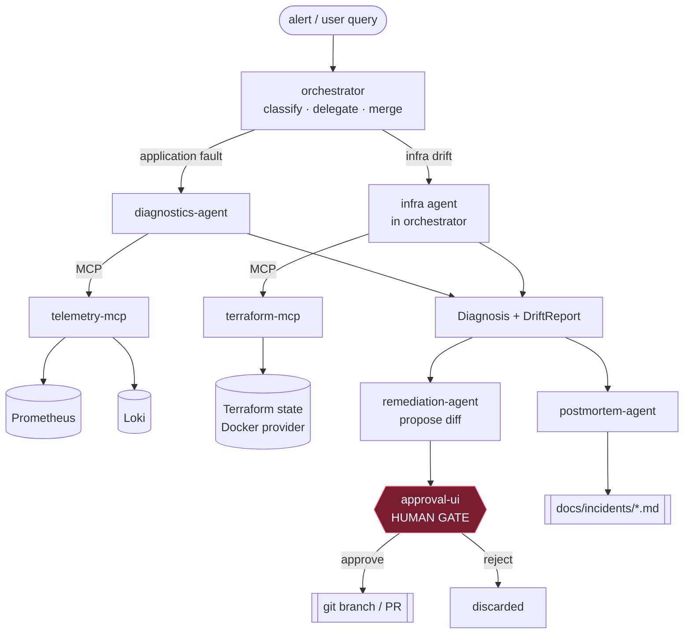
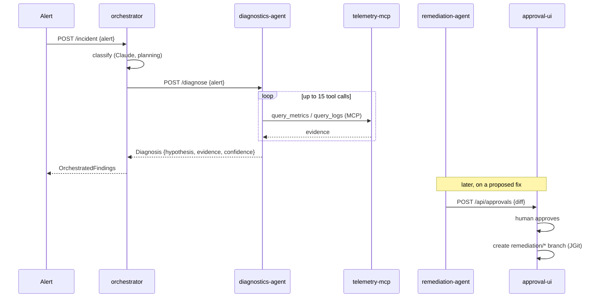

# Architecture

The copilot is a set of small Spring Boot services that cooperate to turn an incident alert into a
diagnosis, a reviewable fix, and a postmortem — all read-only by default, with a human gate before
anything can change.

## Components

| Service | Port | Role |
|---|---|---|
| `demo-app` | 8080 | The "victim" microservice with fault-injection endpoints |
| `telemetry-mcp` | 8090 | MCP server: `query_metrics`, `query_logs`, `list_alerts` (Prometheus/Loki) |
| `terraform-mcp` | 8091 | MCP server: `read_state`, `plan_diff` (Terraform drift, read-only) |
| `diagnostics-agent` | 8100 | Agentic loop → evidence-cited `Diagnosis` |
| `orchestrator` | 8110 | Classifies an incident, delegates, merges findings |
| `remediation-agent` | 8120 | Proposes a fix as a diff (never applies) |
| `approval-ui` | 8130 | Human approval queue + trace viewer; approve → branch/PR |
| `postmortem-agent` | 8140 | Timeline-from-traces Markdown postmortem |
| `evals` | — | On-demand harness: inject faults, score, scorecard |
| Prometheus / Loki / Grafana / Promtail | 9090 / 3100 / 3000 | Local observability stack (stands in for CloudWatch) |

`copilot-core` is a framework-neutral library shared by all services: the domain model
(`Diagnosis`, `DriftReport`, `ProposedRemediation`, …), the provider abstractions
(`TelemetryProvider`, `InfraStateProvider`), model routing (`ModelRouter`), and tracing
(`AgentTrace`, `TraceStore`).

## System diagram

## Request flow (happy path)

## Model routing

A `ModelRouter` maps task types to models: planning/hypothesis → Sonnet, cheap/high-volume steps
(log summarization) → Haiku. Every LLM call is traced with model, tokens, latency, and an estimated
cost, viewable per incident in the approval UI's trace viewer.

## Provider abstraction (local now, AWS later)

`TelemetryProvider` and `InfraStateProvider` are the seams that make this "local-first now, AWS
later." The Prometheus/Loki and Terraform-Docker implementations live in the MCP servers; a future
`CloudWatchTelemetryProvider` implements the same interface — a configuration change, not a rewrite.
See [`infra/aws/README.md`](../infra/aws/README.md).

See also [guardrails.md](guardrails.md) and [failure-analysis.md](failure-analysis.md).
